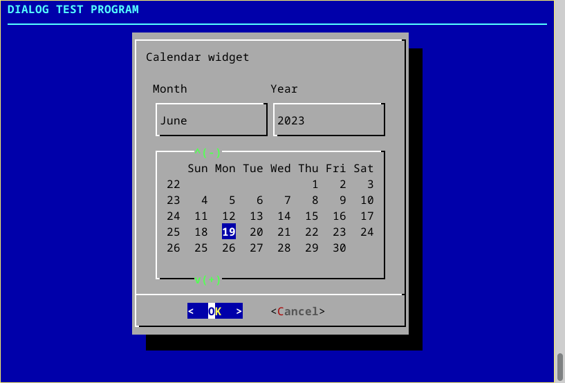
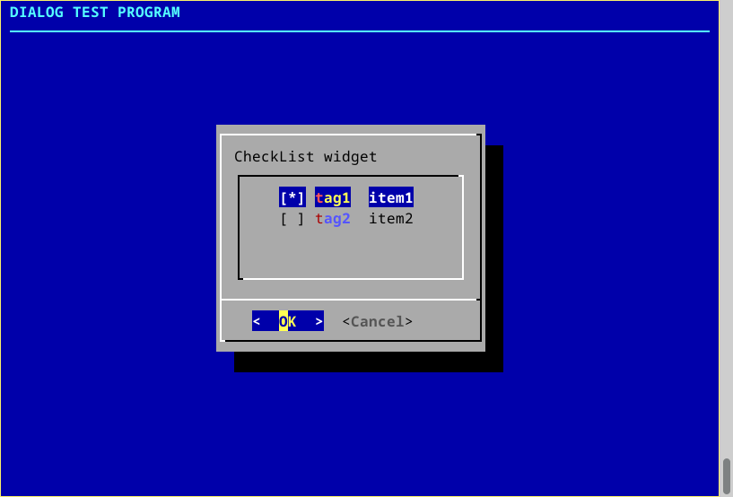
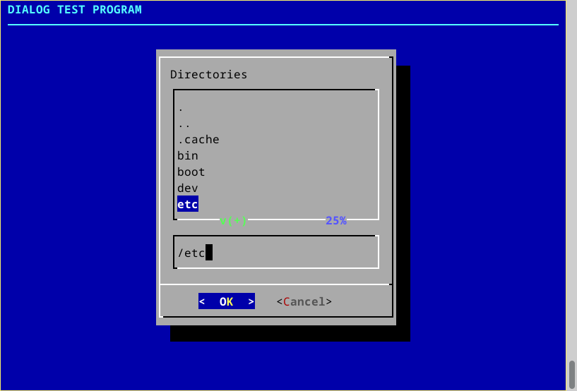
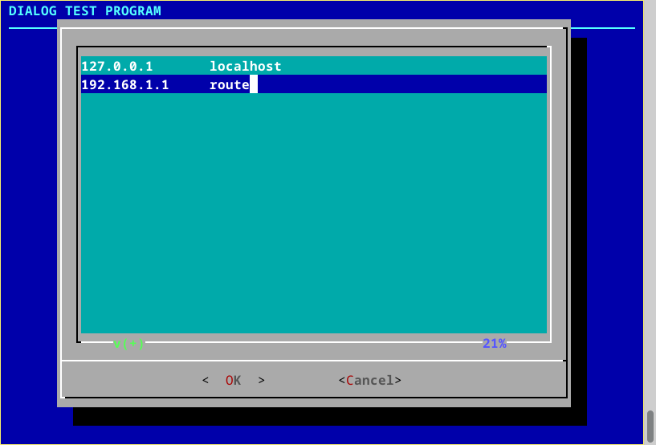
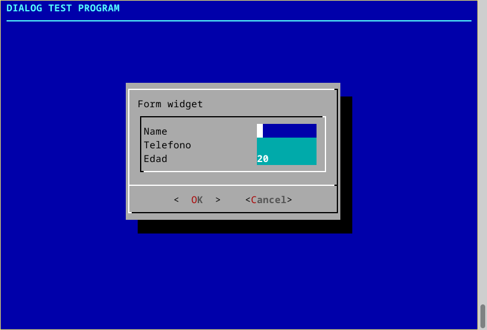
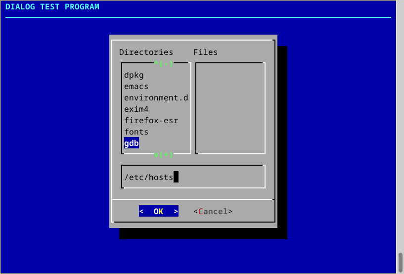
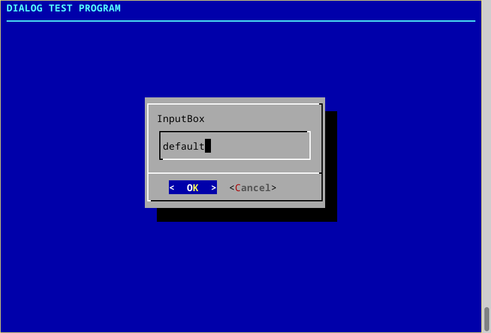
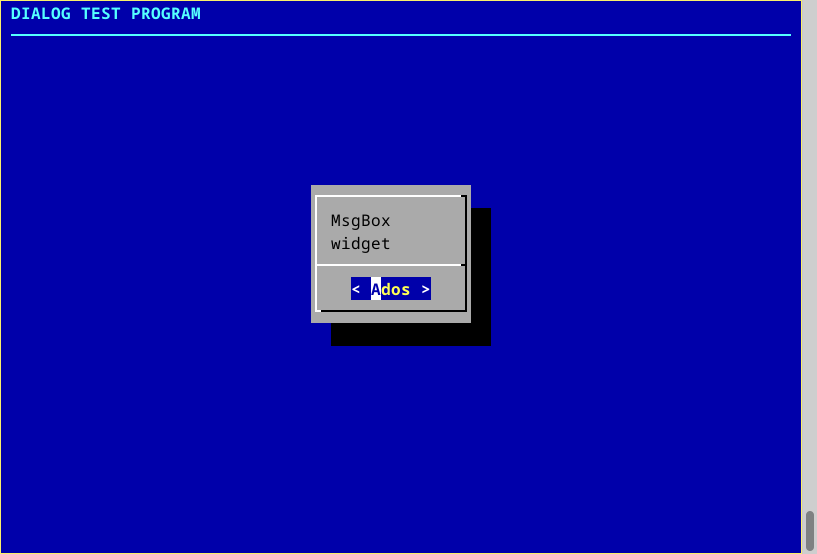
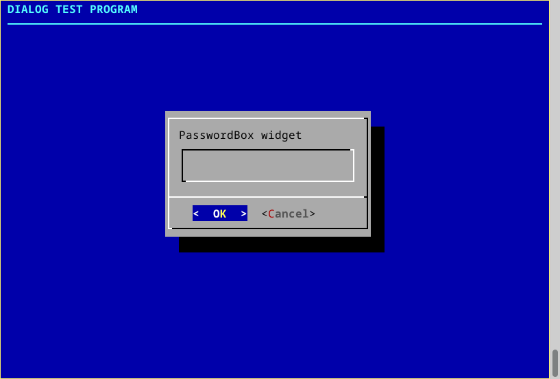
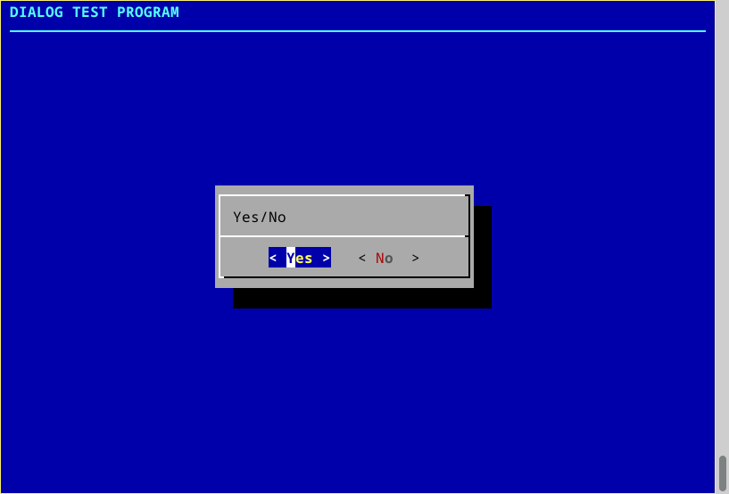

# GO-DIALOG

GO interface to dialog(1). Read the example [here](./cmd/go-dialog/main.go) to
view at a glance how to work with it.

## Requirements.

- To have *dialog(1)* installed, it comes preinstalled in most Linux
  and Unixes.

## TODO

- Add all the options *dialog(1)* offers.
- Document better.
- A lot, most MR will be accepted.

## Go documentation

    package dialog // import "github.com/harkaitz/go-dialog"
    
    func AddG(options ...string)
    func Calendar(text string, stime time.Time) (t time.Time, ok bool, err error)
    func CheckList(msg string, items []TagItemStatus) (tags []string, ok bool, err error)
    func Config(options ...string)
    func ConfigG(options ...string)
    func DSelect(dir string) (path string, ok bool, err error)
    func EditBox(file string) (content string, ok bool, err error)
    func ExecDialog(args ...string) (res string, ok bool, err error)
    func FSelect(fil string) (path string, ok bool, err error)
    func Form(msg string, labelWidth, valueWidth int, fields []FormField) (data []string, ok bool, err error)
    func InfoBox(msg string) (res string, ok bool, err error)
    func InputBox(msg string, initOpt string) (res string, ok bool, err error)
    func Menu(msg string, menu []MenuItem) (key string, ok bool, err error)
    func MenuList(msg string, menu []string) (num int, ok bool, err error)
    func MsgBox(msg string) (ok bool, err error)
    func PasswordBox(msg string, initOpt string) (res string, ok bool, err error)
    func Pause(msg string, secs int) (ok bool, err error)
    func RadioList(msg string, items []TagItemStatus) (sel string, ok bool, err error)
    func RangeBox(msg string, min, max, def int) (res int, ok bool, err error)
    func Size(h, w int)
    func TextBox(file string) (ok bool, err error)
    func TextBoxString(msg string) (ok bool, err error)
    func YesNo(msg string) (ok bool, err error)
    type FormField struct{ ... }
    type MenuItem struct{ ... }
    type TagItemStatus struct{ ... }

## Examples

<table>
  <tbody>
    <tr>
      <td> Calendar      </td>
      <td> CheckList    </td>
    </tr>
    <tr>
      <td> DSelect    </td>
      <td> EditBox    </td>
    </tr>
    <tr>
      <td> Form          </td>
      <td> FSelect    </td>
    </tr>
    <tr>
      <td> InputBox    </td>
      <td> Menu            </td>
    </tr>
    <tr>
      <td> MsgBox              </td>
      <td> PasswordBox    </td>
    </tr>
    <tr>
      <td> RadioList    </td>
      <td> YesNo            </td>
    </tr>
    
  </tbody>
</table>
